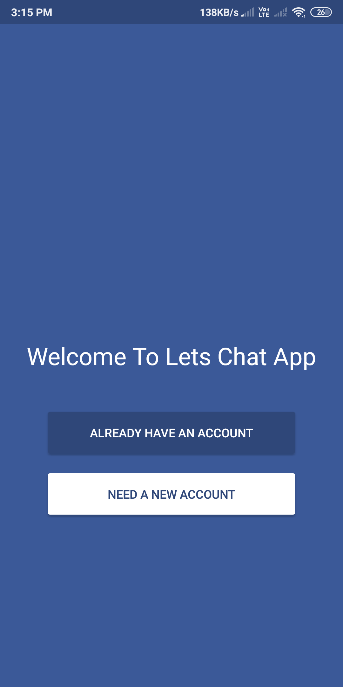
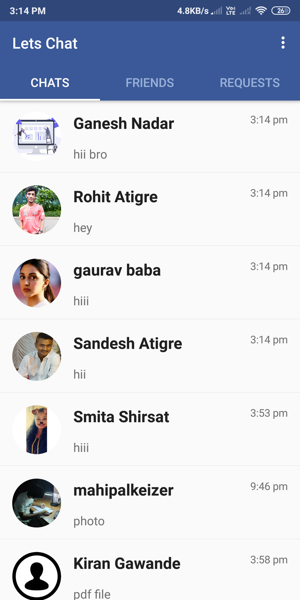
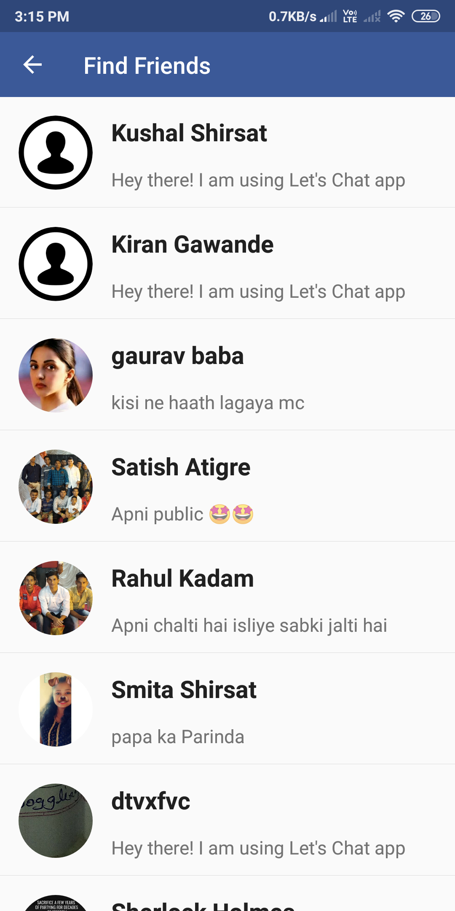
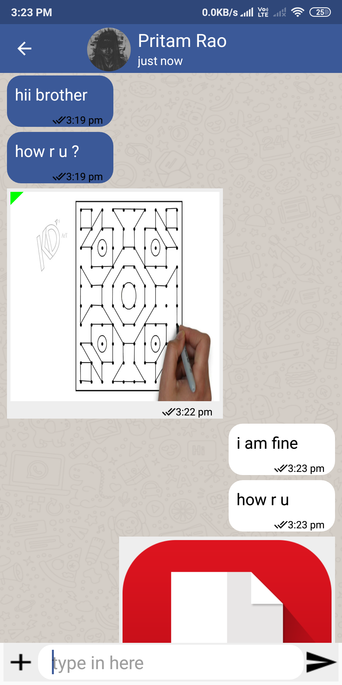
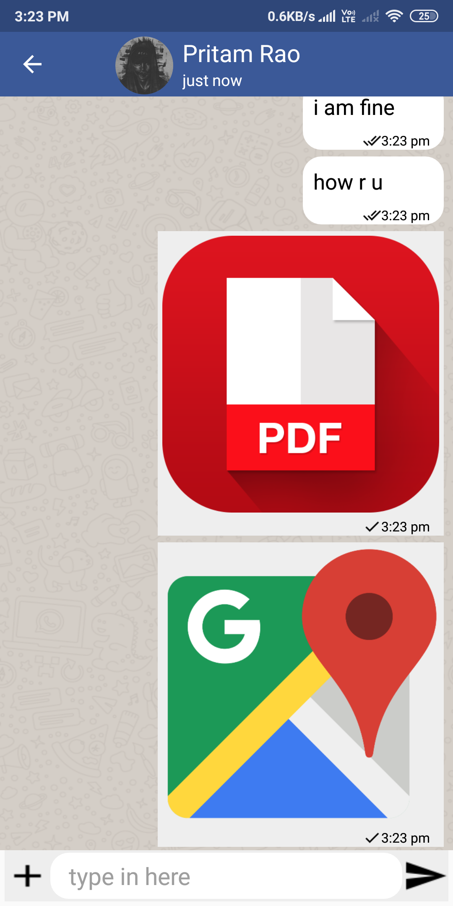
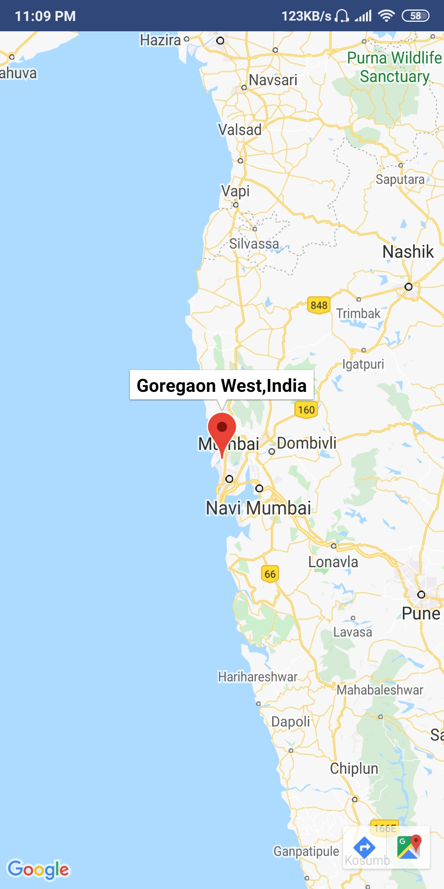
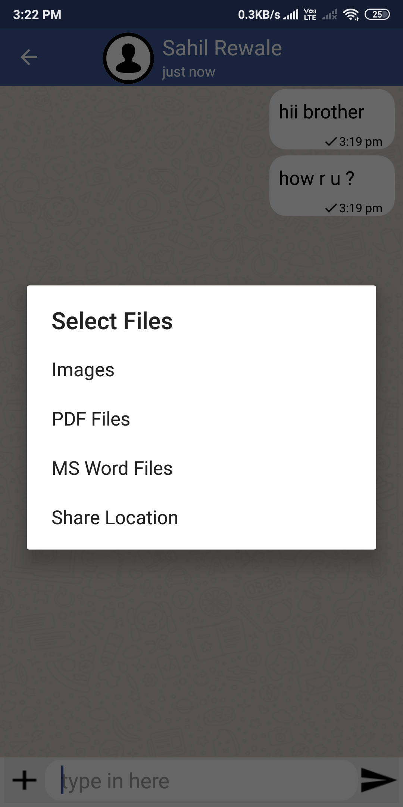
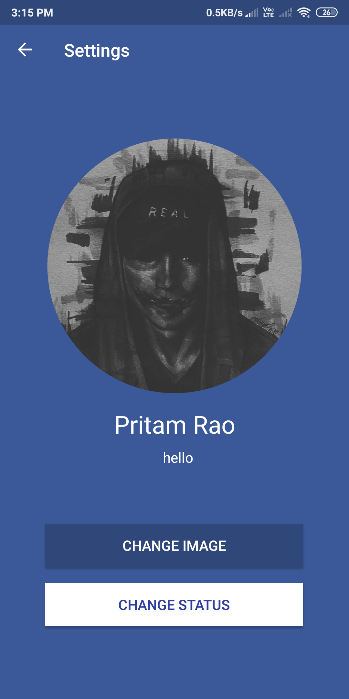
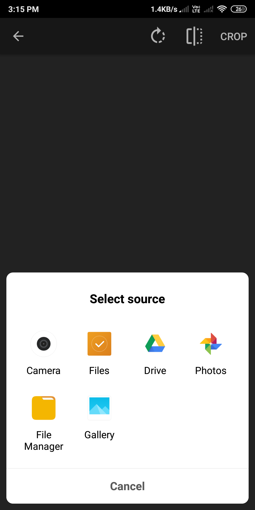

# Lets-Chat &nbsp; 
This is a mobile application built with android studio and firebase as backend which includes social media functionalities along with user-friendly ui, real-time chatting experience, and many more 

## Key Features
* Android Material Designs for UI
* Finding friends online
* Private Messaging
* Data Compression for big size file sharing
* High quality file sharing (images,pdf,docx)
* Real time location sharing
* Online Presence system (whether other users are online or not)
* Read receipts (message read by the other user or not)
* Last seen of the user
* Emoji support during chatting
* Dynamic update of UI (based on time of message latest first)
* Ability to update Status and profile picture

## Some pictures demonstrating key features

Login Page          |  Home Page          |  Find Friends
:-------------------------:|:-------------------------:|:-------------------------:
|   | |  

 

Chat Fragment          |  Chat Fragment           |  Loaction Sharing
:-------------------------:|:-------------------------:|:-------------------------:
|   | |  

 

File Sharing          |  User Setting           |  Change Profile
:-------------------------:|:-------------------------:|:-------------------------:
|   | |  

 

## Technologies and Tools Used
- Android Studio (Java)
- Firebase Database
- Firebase Storage
- Google maps api 
- Zelory Compressor
- Git for version control 

## Language Used - Java
- Different OOP concepts were used like Inheritance, Encapsulation , Abstraction ,Polymorphism ,etc
- Multithreading was used for real time user experience.

## Getting Started
- You need Android Studio installed along with java jdk.
- Copy the clone url and select get from version control on android studio.
- Paste the clone url link into url section and hit clone.
- Install all the dependecies which android studio asks and you are all done.

## Acknowledgments
**We are very thankful to all the contributors of theses APIs which made our jobs easier.**
* [Hdodenhof](https://github.com/hdodenhof/CircleImageView) - To view images in oval shape.
* [Image Loader & Cropper](https://github.com/ArthurHub/Android-Image-Cropper) - To load image from device and cropping it in square shape.
* [Picasso](https://github.com/square/picasso) - Image downloading and caching library for Android.

**Any suggestions or improvement are welcome..**
